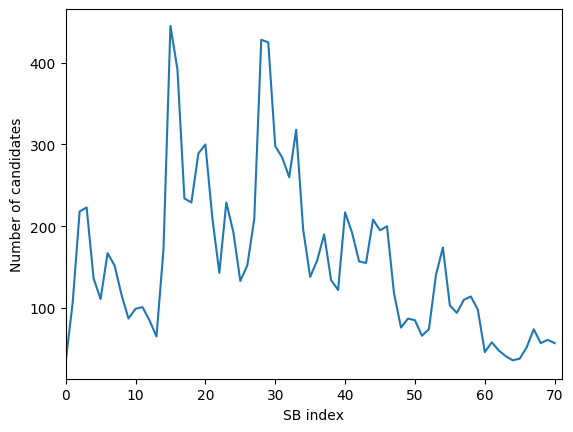
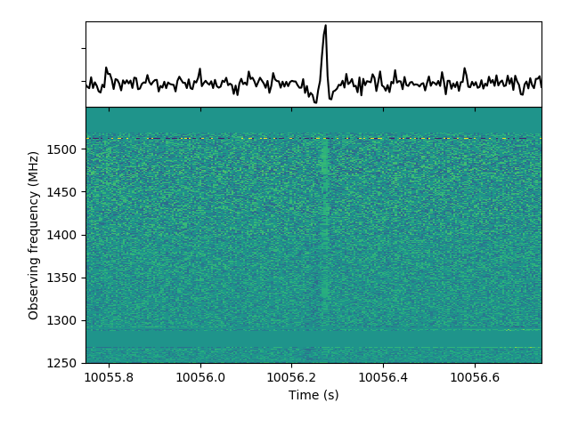

Synthesised beam tutorial
-------------------------
In this tutorial, tied-array beam (TAB) data will be downloaded from the Apertif Long Term Archive (ALTA),
and converted into a set of synthesised beams (SBs). The SBs correct the TABs for their frequency-dependent pointing. 
They are *not* corrected for the time-dependent orientation of the TABs. Hence, the SB pointing is time-dependent so they 
are suitable for transient searches but not for periodicity searches.

Choosing and downloading data
^^^^^^^^^^^^^^^^^^^^^^^^^^^^^
For this tutorial we will use the same data as for the tracking beam tutorial. Please follow the data selection and downloading 
sections of the :ref:`tracking beam tutorial <tutorials/TB:Tracking beam tutorial>`.

Synthesised beam background
^^^^^^^^^^^^^^^^^^^^^^^^^^^^^^
A set of 71 SBs fully covers one compound beam (CB) when observing on the meridian. At large hour angles, fewer SBs
are required due to baseline projection effects. The TAB to SB mapping is fixed, meaning that the pointing of a given 
SB depends relative to the CB centre depends on the telescope pointing. Tools to calculate the pointing of an SB
are in progress. 

It is expected to see a transient in several SBs simultaneously. Because they are made out of 12 TABs, the SBs have sidelobes
that coincide with the main lobe of an SB offset by an integer multiple of 12. E.g. SB35 has sidelobes that coincide 
with the main lobes of SBs 11, 23, 47, 59. This holds the other way around as well: SBs 11, 23, 47, 59 have a sidelobe
near the main lobe of SB35. The sidelobes typically suffer from chromatic effects; only the main lobe has broadband sensitivity
in the pointing direction of the SB.

Feel free to contact `Leon Oostrum <l.oostrum@esciencecenter.nl>`_ if you have questions about the synthesised beams.

Creating the synthesised beams
^^^^^^^^^^^^^^^^^^^^^^^^^^^^^^
The synthesised beam script currently creates one SB at a time. Generating all 71 SBs can be done with a simple bash loop::

   for sb in {0..70}; do
     arts_create_synthesised_beam --sb $sb --input_folder data/
   done

This generates 71 files::

  (py36) leon@zeus:SB$ ls *.fits
  ARTS190406012_CB35_SB00.fits  ARTS190406012_CB35_SB15.fits  ARTS190406012_CB35_SB30.fits  ARTS190406012_CB35_SB45.fits  ARTS190406012_CB35_SB60.fits
  ARTS190406012_CB35_SB01.fits  ARTS190406012_CB35_SB16.fits  ARTS190406012_CB35_SB31.fits  ARTS190406012_CB35_SB46.fits  ARTS190406012_CB35_SB61.fits
  ARTS190406012_CB35_SB02.fits  ARTS190406012_CB35_SB17.fits  ARTS190406012_CB35_SB32.fits  ARTS190406012_CB35_SB47.fits  ARTS190406012_CB35_SB62.fits
  ARTS190406012_CB35_SB03.fits  ARTS190406012_CB35_SB18.fits  ARTS190406012_CB35_SB33.fits  ARTS190406012_CB35_SB48.fits  ARTS190406012_CB35_SB63.fits
  ARTS190406012_CB35_SB04.fits  ARTS190406012_CB35_SB19.fits  ARTS190406012_CB35_SB34.fits  ARTS190406012_CB35_SB49.fits  ARTS190406012_CB35_SB64.fits
  ARTS190406012_CB35_SB05.fits  ARTS190406012_CB35_SB20.fits  ARTS190406012_CB35_SB35.fits  ARTS190406012_CB35_SB50.fits  ARTS190406012_CB35_SB65.fits
  ARTS190406012_CB35_SB06.fits  ARTS190406012_CB35_SB21.fits  ARTS190406012_CB35_SB36.fits  ARTS190406012_CB35_SB51.fits  ARTS190406012_CB35_SB66.fits
  ARTS190406012_CB35_SB07.fits  ARTS190406012_CB35_SB22.fits  ARTS190406012_CB35_SB37.fits  ARTS190406012_CB35_SB52.fits  ARTS190406012_CB35_SB67.fits
  ARTS190406012_CB35_SB08.fits  ARTS190406012_CB35_SB23.fits  ARTS190406012_CB35_SB38.fits  ARTS190406012_CB35_SB53.fits  ARTS190406012_CB35_SB68.fits
  ARTS190406012_CB35_SB09.fits  ARTS190406012_CB35_SB24.fits  ARTS190406012_CB35_SB39.fits  ARTS190406012_CB35_SB54.fits  ARTS190406012_CB35_SB69.fits
  ARTS190406012_CB35_SB10.fits  ARTS190406012_CB35_SB25.fits  ARTS190406012_CB35_SB40.fits  ARTS190406012_CB35_SB55.fits  ARTS190406012_CB35_SB70.fits
  ARTS190406012_CB35_SB11.fits  ARTS190406012_CB35_SB26.fits  ARTS190406012_CB35_SB41.fits  ARTS190406012_CB35_SB56.fits
  ARTS190406012_CB35_SB12.fits  ARTS190406012_CB35_SB27.fits  ARTS190406012_CB35_SB42.fits  ARTS190406012_CB35_SB57.fits
  ARTS190406012_CB35_SB13.fits  ARTS190406012_CB35_SB28.fits  ARTS190406012_CB35_SB43.fits  ARTS190406012_CB35_SB58.fits
  ARTS190406012_CB35_SB14.fits  ARTS190406012_CB35_SB29.fits  ARTS190406012_CB35_SB44.fits  ARTS190406012_CB35_SB59.fits

These files can now be searched for single pulses with your favourite pulsar tool. 

.. note::
  The data are one bit per sample, which not every tool understands natively.

As noted in the tracking beam tutorial, these data contain a known pulsar, PSR J0358+5413, at a DM of 57.14 pc/cc.
Dedispersing all SBs to that DM, and searching for single pulses above a S/N of 8 clearly shows the periodicity of 12 SBs:

In order to determine the "real" SB the source was located in, proper localisation analysis should be run. For that,
a separate package is available: `ARTS localisation <https://github.com/loostrum/arts_localisation>`_. In this case,
the SB with the highest number of candidates is probably the one where the source was located in. Let's make a figure
of the candidate with the highest S/N in that SB, SB 15:

.. note::
  The above figure was made with PRESTO's `waterfaller.py`. To make that script work with the ARTS 1-bit files, `psrfits.py`
  needs to be modified. It already contains code to unpack 4-bit and 2-bit data. Add two lines to unpack
  1-bit data so the complete section looks like something like this::

    if self.nbits < 8: # Unpack the bytes data
        if self.nbits == 1:
            sdata = np.unpackbits(sdata)
        elif self.nbits == 4:
            sdata = unpack_4bit(sdata)
        elif self.nbits == 2:
            sdata = unpack_2bit(sdata)
        elif (shp[0] != self.nsamp_per_subint) and \
             (shp[1] != self.nchan * self.npoln * self.nbits // 8): 
            sdata = sdata.reshape(self.nsamp_per_subint,
                                  self.nchan * self.npoln * self.nbits // 8)

 
