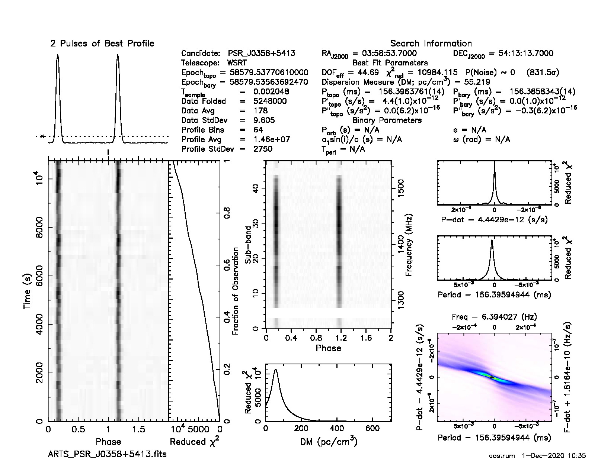

Tracking beam tutorial
----------------------
In this tutorial, tied-array beam (TAB) data will be downloaded from the Apertif Long Term Archive (ALTA),
and converted into a tracking beam (TB) that tracks a known pulsar over the entire observation.
The TB corrects for two effects:

* The frequency-dependent pointing of the TABs.
* The time-dependent rotation of the TABs w.r.t. the RA-Dec frame.

Choosing a data set
^^^^^^^^^^^^^^^^^^^
An overview of public data can be found on the `ALTA website <https://alta.astron.nl>`_. In the upper left
corner of that page, click on "Science". Then select the "Science Verification Campaign 2019 (Time Domain)" 
data release from the drop-down menu in the upper right corner. For this tutorial, we will use the observation of field
G0401+5324, with ID 190406012. Click on "Details" to see more information about the observation:
It is a 3-hour pointing towards RA=04:01:53.00, Dec=+53:24:05.00 (J2000) at a central frequency of 1400 MHz.

The following command from `arts_tools <https://github.com/loostrum/arts_tools>`_
prints the known pulsar in the field with a flux density at 1400 MHz of at least 10 mJy::

  (py36) leon@zeus:TB$ arts_find_pulsars_in_field --freq 1400 --ra 04:01:53.00 --dec +53:24:05.00 --condition 'S1400 > 10'
  Querying ATNF
  Locating pulsars in Apertif Compound Beams
  Pulsars found:
  PSR J0358+5413 in CB35, separation from CB centre: 12.61"

Downloading data
^^^^^^^^^^^^^^^^
The data can be downloaded from the ALTA web interface, but also using a command line tool from `arts_tools`
(total size is about 3.6 GB)::

  arts_download_from_alta --release SVC --taskid 190406012 --cbs 35 --output_folder data/ --verbose
  
The ``--verbose`` flag adds a progress bar.
The following data are now available::

  (py36) leon@zeus:TB$ ls data
  ARTS190406012_CB35_TAB00.fits  ARTS190406012_CB35_TAB03.fits  ARTS190406012_CB35_TAB06.fits  ARTS190406012_CB35_TAB09.fits
  ARTS190406012_CB35_TAB01.fits  ARTS190406012_CB35_TAB04.fits  ARTS190406012_CB35_TAB07.fits  ARTS190406012_CB35_TAB10.fits
  ARTS190406012_CB35_TAB02.fits  ARTS190406012_CB35_TAB05.fits  ARTS190406012_CB35_TAB08.fits  ARTS190406012_CB35_TAB11.fits

Creating the tracking beam
^^^^^^^^^^^^^^^^^^^^^^^^^^
As there is only one data set in the data folder, creating a TB is now very straightforward::

  (py36) leon@zeus:TB$ arts_create_tracking_beam  --source "PSR J0358+5413" --input_folder data
  
.. note::
  If there are multiple data sets in the input folder, use the ``--taskid`` and ``--cb`` flags to select the correct data.

This script creates a file called ``ARTS_PSR_J0358+5413.fits``, containing the right TAB at each frequency/time point
to track the given pulsar.

.. note::
  The data are one bit per sample, which not every tool understands natively.

Now you can use your favourite pulsar tool to further process the file. For example, folding the data with PRESTO::

  prepfold -psr J0358+5413 -noscales -noweights -nooffsets ARTS_PSR_J0358+5413.fits
  
This results in the following figure:

